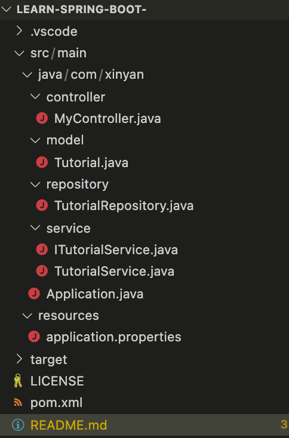

# Spring Boot Tutorial
This is the simple tutorial project for learning Spring Boot, which will create a RESTFUL API, connect to the Postgres database and has also unit test.

This is our project structure:

## 1. Environment Requirements

Spring Boot 2 requires from **Java 8** to **Java 11** to run. We recommend [installing OpenJDK](https://frontbackend.com/linux/installing-openjdk-on-ubuntu-18-04) if you don't have it already on your OS. Additionally to build and deploy Spring Boot applications we will also need: maven ([Install Apache Maven on Ubuntu](https://frontbackend.com/linux/how-to-install-apache-maven-on-ubuntu-18-04))

## 2. pom.xml

The POM ( Project Object Model ) is the basic unit of work for `Maven projects`, an XML file containing basic information about the project, used to describe how the project is built, declare project dependencies, and so on.

## 3. Source Code Structure

We will use maven to build our app so special folder structure is needed:

- `src/main/java` - source directory,
- `src/main/resources` - resources directory (we will put here configuration files like for example **application.properties**).

In source directory, we have 4 layer: *model*, *repository*, *service* and *controller*.

## 4. Running Spring Boot Web Application

First build our project with `mvn clean install`command, and after **SUCCESS**
 result, go to **target** folder. There should be `spring-boot-app-0.0.1-SNAPSHOT.jar` file there.

In project root folder type `mvn spring-boot:run` command that should build your project and start Spring Boot right after that.

For API test, recommended to use Postman.

### We offer the following APIs:

GET /api/hello?name=***: home page

GET /api/tutorials?title=*** : get list of tutorials

GET /api/tutorials/{id}: get one tutorial

POST /api/tutorials : create a tutorial

PUT /api/tutorials/{id} : update a tutorial

DELETE /api/tutorials/{id}: delete tutorial by book id

DELETE /api/tutorials : delete all tutorials

GET /api/tutorials/published : find published tutorials
